# Class Attendance System based on Face Recognition

基于人脸识别的课堂考勤系统

---

> Contributor : datamonday
>
> Github Repo : https://github.com/datamonday/Face-Recognition-Class-Attendance-System
>
> Initial Blog : [基于人脸识别的考勤系统：Python3 + Qt5 + OpenCV3 + OpenFace + MySQL](https://blog.csdn.net/weixin_39653948/article/details/89291751?spm=1001.2014.3001.5502)
>
> Project Post : 2019.04.14
>
> Last Update : 2021.05.25

---
# Update: 2021.05.25

又到毕业季，在交流群里收到了很多问题，终于有时间集中进行处理，为了让该项目更容易上手且更鲁棒，主要做了如下更新：

- 对项目进行了重构，使得风格更gayhuber；（！正在进行中）
- 完善了考勤逻辑，使用excel表格导入教室的课表，更加便捷；
- 考勤涉及大量的时间序列操作，因此使用了Pandas和Datetime模块进行处理；
- 增加了环境配置文件requirements.txt和environment.yaml，对小白更友好；
- 添加了详细的使用教程；
- 集中解决了之前存在的卡顿和闪退问题；
- 增加了许多提示信息，方便在无提示退出的情况下定位错误。

再看两年多前以前写的代码，发现很多都写死了，并且实现思路不甚清晰，导致修复bug的同时又会造成新的bug，所以重写了代码，并将需要修改的参数集中，方便移植。

---

# 1. 项目简介及声明

🎠**本项目使用Python3.6开发（2021-05-23更新到Python3.8）。主要包括四部分：（1）前端界面设计：使用Qt Designer（QT5）设计主界面，PyQt5编写界面控件的槽函数。（2）人脸识别算法：使用Google在2015年提出的人脸识别算法FaceNet进行人脸识别，其中人脸检测部分使用OpenCV提供的ResNet-SSD预训练模型，使用OpenFace开源的基于Inception的FaceNet预训练模型。（3）活体检测部分，使用dlib库的眨眼检测来实现活体识别。（4）信息管理：使用PyMySQL实现学生信息，教室及课表信息，考勤信息的集中统一化管理。**

本项目针对的是教师或者说是个人使用者这种小范围签到的情况，其实现机制也比较简单。近期也在探索实现全校人脸识别考勤信息统一集中管理，但具体实现比较复杂，相当于将考勤系统和人脸识别融合。一方面考勤系统本身逻辑比较复杂，考虑到的情况比较多，短期内难以实现；另一方面，人脸数据的采集和人脸识别算法的识别上限和准确率决定了能否落地，综合考虑时间因素和学习成本，故暂未更进一步。读者感兴趣可自行探索，欢迎提出建议和解决方案。

**🐱‍👓本项目开始于2018年年末，大概持续了两三个月的时间，2019年4月发布博客并开源，2021年5月重构了代码库。因为本项目仅由一个人开发，能力精力有限，实现了预期的一部分功能，没有经过完整周全的测试，部分功能存在bug（例如活体检测可能出现界面卡死。），但在空余时间还在积极修复，争取实现初衷。如果有不懂的地方或者更好的建议，欢迎在评论区，github，交流群提出。**

**在开发过程中，遇到过许多难题，参考了很多教程，才有了这个项目。相信大家看到这里，一定是在科创比赛或作业中遇到了类似的问题，我也有过类似的经历，很清楚找不到解决方案，自己盲目摸索的苦恼，这也是我选择开源的原因，个人能力有限，但是希望本项目能给需要的小伙伴提供帮助。**

<font color=red>**声明：本人不提供有偿写代码，代做毕业设计，代写毕业论文服务，有违初衷，有这样想法的不用私信和添加好友了！有这时间还不如干自己喜欢干的事！本人也并未授权任何人代表本人提供有偿服务，谨防上当受骗！欢迎提出问题与建议，但不欢迎投机倒把。代码和教程已经是掰开了揉碎了，算是保姆级教程了，多花点时间看代码，很多问题都可以自行解决，别老想着让别人把东西喂到嘴边。**</font>

最后，善用Google，善用Stack Overflow。

---

#  2. 环境配置🎡

## 2.1 Anaconda 创建虚拟环境

打开官方地址并下载对应版本：

https://www.anaconda.com/products/individual#Downloads

如果追求轻量化，使用miniconda也可以，只不过没有navigator。

安装完成后，打开 Anaconda Prompt，并按以下步骤输入：

1. 创建虚拟环境 `fr` ，设置Python版本为 3.8.0

   ```shell
   conda create -n fr python==3.8
   ```

2. 激活虚拟环境

   ```shell
   conda activate fr
   ```

---

## 2.2 安装所需要的包

在新开的命令行，激活虚拟环境后，按如下步骤操作。

方式一：requirements.txt 安装

该文件是我在本地新建的测试通过的环境中所使用的的包，可以直接安装，避免了一个一个包安装的繁琐步骤。打开命令行并切换到该文件所在的根目录，输入如下命令：

   ```shell
   pip install -r requirements.txt
   ```
注：本地环境生成requirements.txt的命令：`pip freeze > requirements.txt`

---

方式二：environment.yaml 安装

这是我在本地的conda虚拟环境，实现功能类似 requirements.txt，如果安装了anaconda的话，可以直接安装。需要注意的是该方式是直接创建一个虚拟环境，如果想在已有的环境中进行配置，则只需要按方式一即可。

```shell
conda env create -f environment.yaml
```

注：导出本地的conda环境命令：`conda env export > d:/environment.yaml`

---

## 2.3 安装 dlib
- 官网：http://dlib.net/
- github：https://github.com/davisking/dlib

注意：需要先安装Visual Studio C++的Community版本或者专业版和企业版都可以，否则报错！只安装 installer 无效，仍会报错！如果之前没有安装VS内核，只安装了 installer，打开控制面板，右击修改安装，重启之后生效。

确认已经安装了VS，打开命令行，激活虚拟环境，直接命令安装即可：

```shell
pip install dlib
```

安装比较耗时，大概几分钟，成功安装截图：
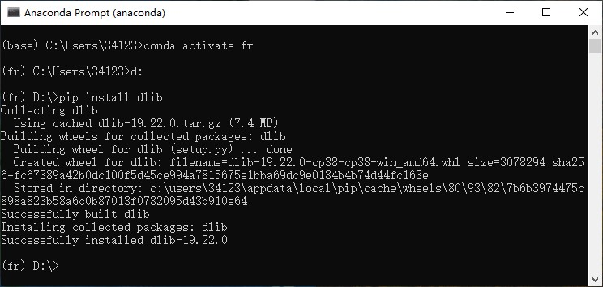


---

# 3. 系统前端设计🤖

使用 Qt Designer 设计前端界面。

## 3.1 主界面

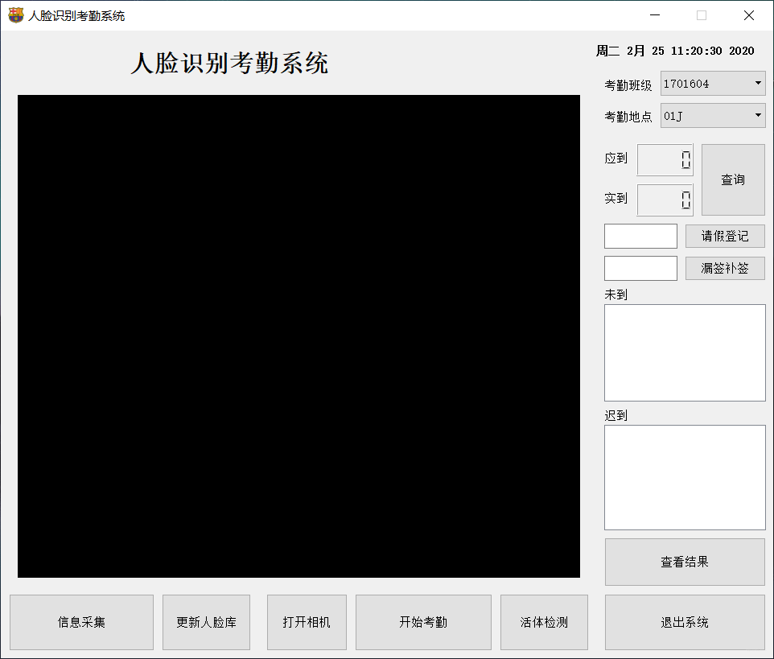

---

## 3.2 信息采集界面

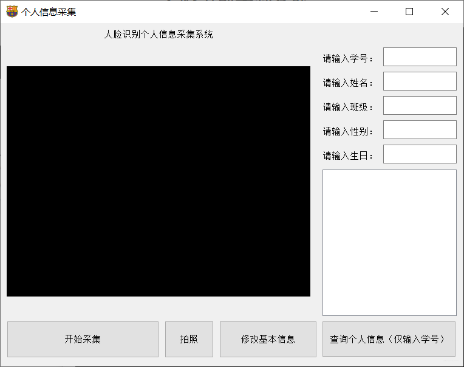


---

# 4. 系统功能介绍🛵

## 4.1 信息采集功能

通过信息采集界面实现，针对学生的人脸图片建库。

## 4.2 人脸识别简介

深度学习人脸识别流程可以总结如下（图自论文：I. Masi, Y. Wu, T. Hassner and P. Natarajan, "**Deep Face Recognition: A Survey**," 2018 31st SIBGRAPI Conference on Graphics, Patterns and Images (SIBGRAPI), 2018, pp. 471-478, doi: 10.1109/SIBGRAPI.2018.00067.）：

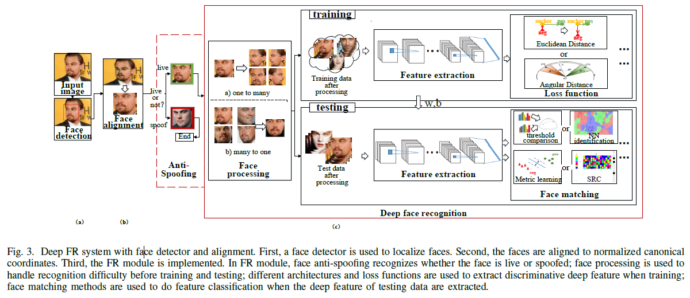


总的来说应用人脸识别分为四步：（1）人脸检测，对输入的图片应用人脸检测算法（本项目中使用OpenCV提供的训练好的ResNet-SSD模型）找出人脸的坐标，过程如下图所示：


（2）应用人脸校正算法，对人脸进行校正，将图像进行保持图片相对平行的基本图像变换，例如旋转和缩放 (仿射变换, affine transformations)，使得眼睛和嘴巴尽可能靠近中心，即目的是将非正视角的人脸校正到使两眼处于同一水平位置。如下图所示：

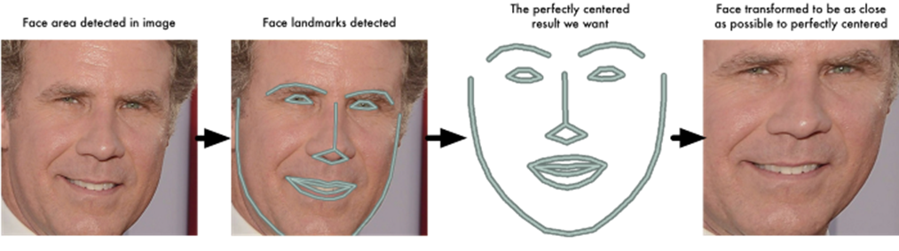

（3）使用人脸识别算法（本文中使用Google在2015年提出的FaceNet，论文 **FaceNet: A Unified Embedding for Face Recognition and Clustering**）对纯人脸图像进行特征提取，FaceNet是将人脸编码为128维的向量，又称为嵌入（embedding），这个属于在自然语言处理领域非常常用。下图是FaceNet的论文中描述的网络架构：

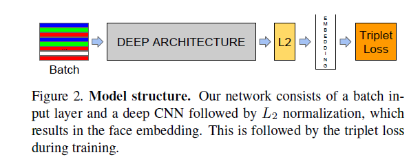

（4）如果是训练的话，上一步已经结束了，但是要应用人脸识别算法，还需要在下游任务上实现分类。故本项目中使用支持向量机（Support Vector Machine，SVM）实现对各人脸128维向量的分类任务。**注意：SVM本质上为二分类器，请保证人脸数据库中至少包含两个人！否则可能导致闪退！** 当然也可以使用神经网络或者距离度量实现，可以自行探索。注：SVM使用scikit-learn提供的[SVC API](https://scikit-learn.org/stable/modules/generated/sklearn.svm.SVC.html)实现。

- 一个使用SVM进行人脸识别的官方例程：[Faces recognition example using eigenfaces and SVMs](https://scikit-learn.org/stable/auto_examples/applications/plot_face_recognition.html#sphx-glr-auto-examples-applications-plot-face-recognition-py)

---

## 4.3 活体检测简介

因为大量的摄像头设备（尤其是考勤中更少）都不是带景深信息的RGBD摄像机，所以无法当前的人脸图像是真人还是人脸，所以需要被识别人进行主动配合，例如眨眼睛（本项目中使用该方法），摇头（例如支付宝设置人脸支付）等，所以活体检测应用而生了。带有景深信息的摄像机一般分为两种，一种是以微软knits为代表的红外摄像机，例如很多笔记本上的人脸解锁。另一种是以苹果FaceID为代表的3D结构光相机。这些相机扫描的人脸均为3D图像，所以识别上更鲁棒，可以完美对抗视频和图片考勤。

但是对于2D摄像机来说，就需要活体检测。本项目中使用开源的dlib库实现人脸特征点的标定，主要利用眨眼的阈值和时长来确定是否为活体。

注意：目前存在一个bug：活体检测开启关闭之后，关闭人脸考勤，再关闭相机时可能导致界面卡死。

## 4.4 查询考勤信息

通过主界面的查看结果按键，可以查看当前考勤的结果，会在主界面左侧文本框中显示包含迟到和旷课的学生。

## 4.5 查询学生信息

通过信息采集界面，实现连接数据库查询学生信息的功能。

## 4.6 补签及请假登记

通过主界面的补签和请假按键，输入学号，实现补签和请假登记，并写入数据库。

---

# 5. 数据库存取信息🥗

## 5.1 数据库可视化工具 Navicat 

使用该软件是为了方便管理维护信息，如果有数据库基础，当然也可以选择其它方式。

## 5.2 创建MySQL数据库

关于本机配置MySQL环境的教程很多，此处不再赘述。仅给出本项目中的创建方式和表格信息。

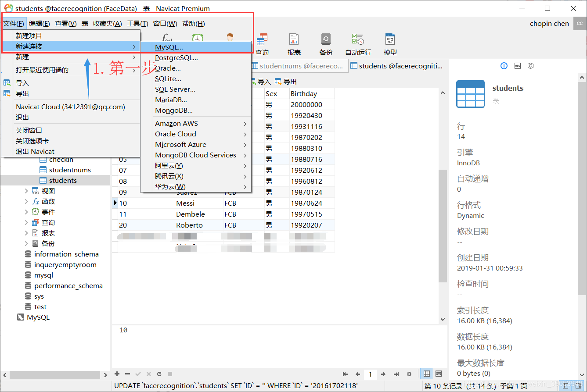
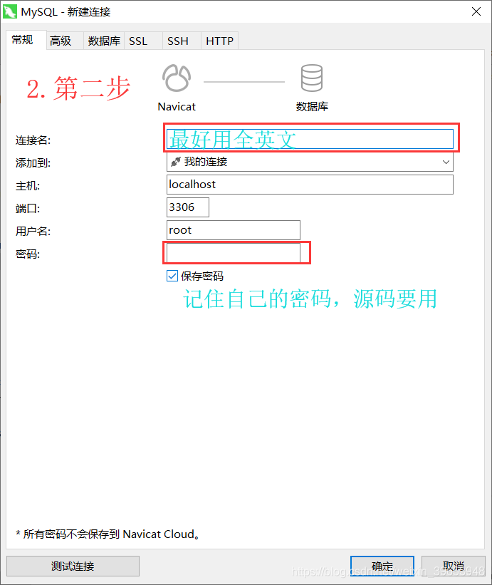
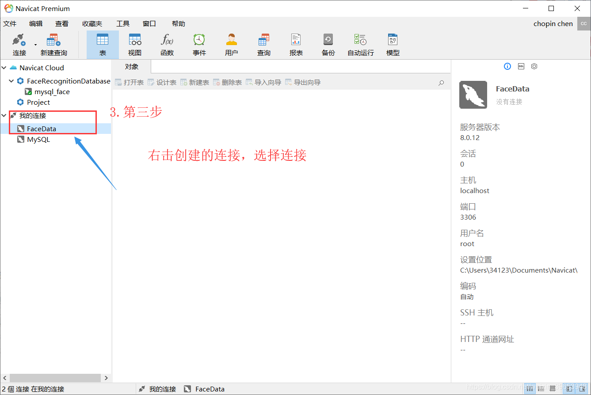
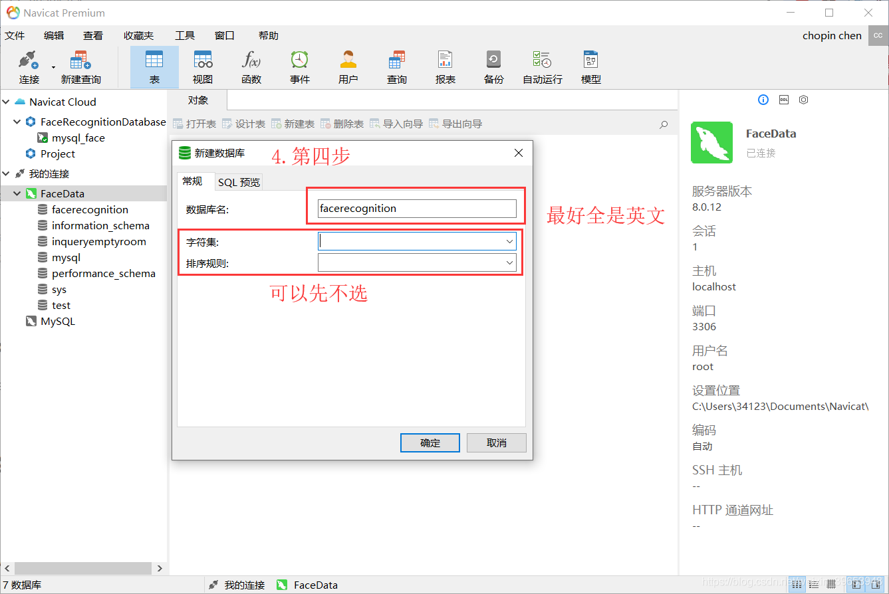
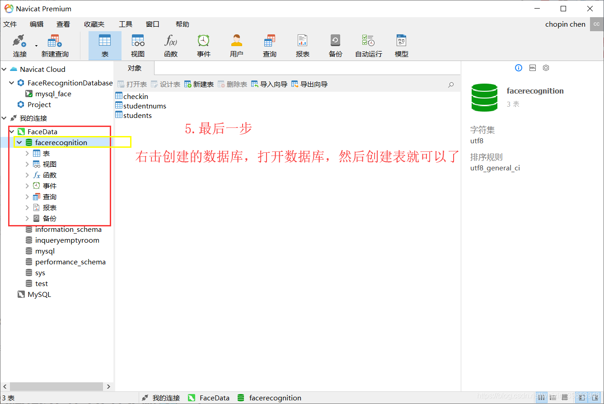


---

## 5.3 MySQL表格及字段说明

其主界面如下：
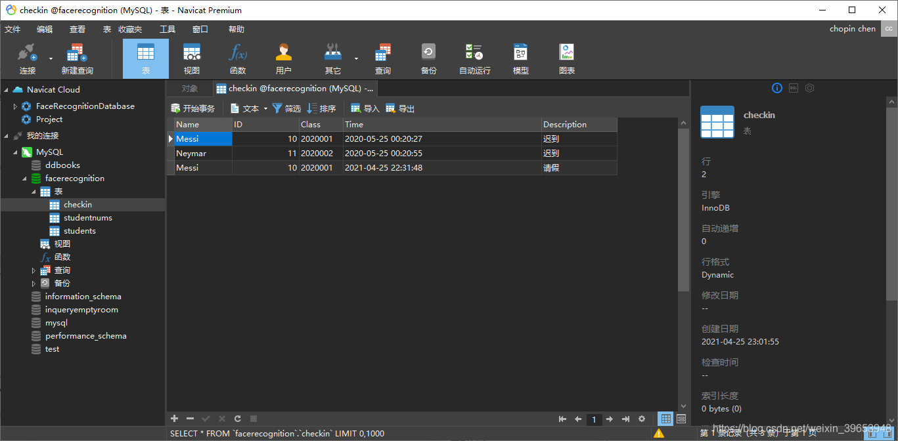
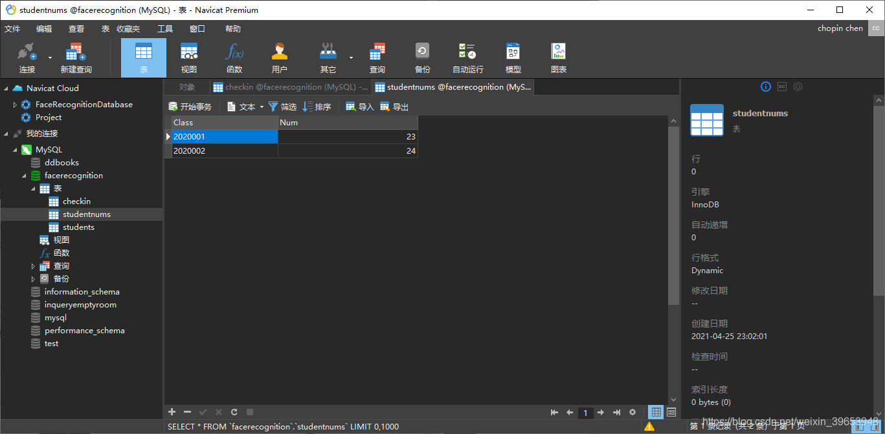
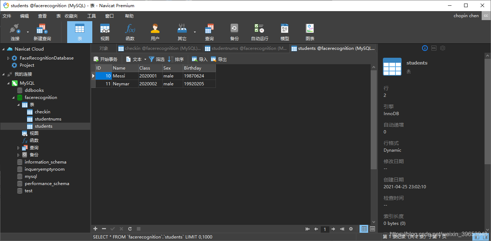


---

## 5.4 PyMySQL 使用

> Github：https://github.com/PyMySQL

项目中只使用了简单的写入、查询等几个常用命令，即使没有数据库基础上手也比较容易。例如：

```python
# 连接数据库
db = pymysql.connect(host="localhost", user="root", password="mysql105", database="facerecognition")

# 查询语句，实现通过ID关键字检索个人信息的功能
sql = "SELECT * FROM STUDENTS WHERE ID = {}".format(self.input_ID)
```

---

## 5.5 本地 Excel 表格说明（测试中）

本部分是打算实现针对全校的考勤系统设计，还不完善。

### Auxiliary_Info.xlsx

包含考勤的辅助信息

### Classroom_Info.xlsx

教室信息

### College_Class_Info.xlsx

学院各班级信息

### Classroom_Course_Schedule.xlsx

教室课程时刻表

### Attendance_Logs.xlsx

考勤日志

---
# 6. 源码介绍及使用🍨 
## 6.1 代码目录树
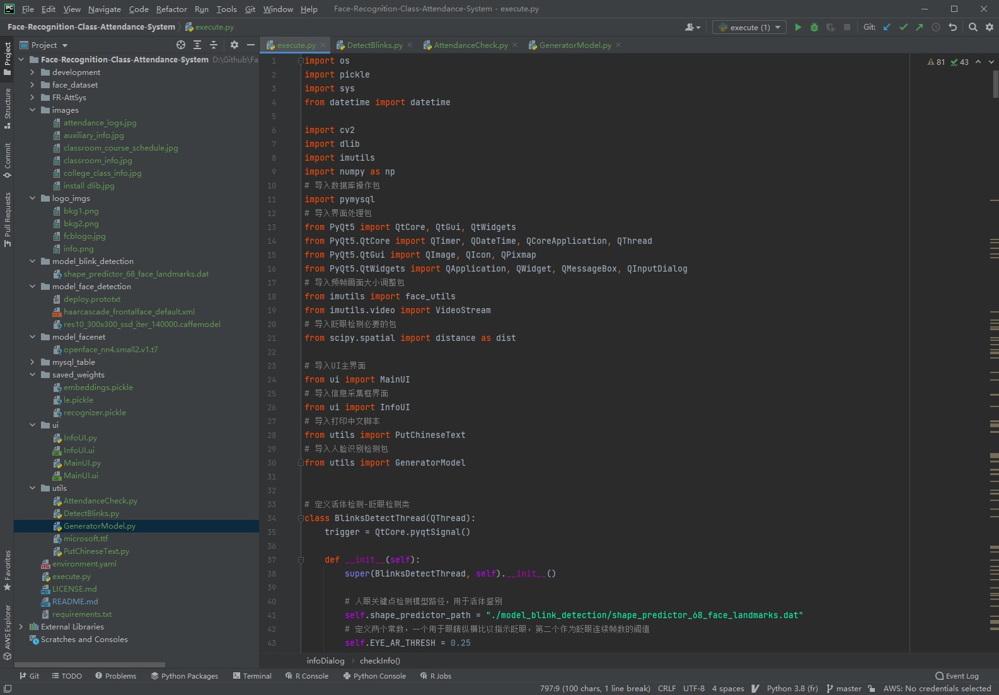

---
## 6.2 关键文件说明

- `model_blink_detection/shape_predictor_68_face_landmarks.dat`：dlib 人脸关键点检测模型，用来实现活体识别（眨眼检测）。
- `model_face_detection/res10_300x300_ssd_iter_140000.caffemodel`：OpenCV提供的训练好的人脸检测ResNet-SSD模型权重。
- `model_facenet/openface_nn4.small2.v1.t7`：OpenFace提供的基于Inception的训练好的FaceNet模型权重。
- `mysql_table/facerecognition.sql`：mysql表格。

---

## 6.3 需要修改源码部分

1. 安装 **msqlservice** 然后修改 `execute.py`文件中的数据库连接代码。比如 `db = pymysql.connect("localhost", "root", "mysql105", "facerecognition")`。这首先需要在 navicat中创建数据库。
2. 如果不是通过本系统的信息采集功能采集的人脸照片，请将采集的人脸照片放到 `face_dataset/XX` 路径下，其中`XX`是学号（唯一索引），如果是通过系统采集的，则会自动存放在该路径下，不需要修改。
3. <font color=red>**注意：考虑到班级成员信息存储在数据库中，因此本地的信息采集界面不支持人脸的增删，只支持修改。所以当在本地采集了很多人脸并训练完模型之后，一定要确保采集的人脸ID已经存在于数据库之中，否则可能导致闪退！**</font>

---

## 6.4 使用步骤 

1. navicat创建数据库，打开数据库录入学生信息和班级信息；
2. 修改源码，连接到创建的数据库；
3. 采集人脸照片，点击界面中的<kbd>信息采集</kbd>，在子窗口操作即可；
4. 训练人脸识别模型，点击界面中的<kbd>更新人脸库</kbd>
5. 开始考勤：<kbd>打开相机</kbd> --> <kbd>开始考勤</kbd>
6. Have fun!😊

更详细的教程，稍后更新。

---

# 7. 难题及解决方案

## 7.1 闪退Bug

总的来说闪退有两种情况导致：

- 一种是你pull到本地之后与我设置的路径不一致，具体需要修改成你自己的路径，注意不要包含中文！
- 数据库中的ID字段与本地人脸文件夹名不一致！或者本地有人脸信息并训练了模型，但数据库并未导入ID及其信息，所以会导致闪退！

### 1）查看结果按键闪退

原因：数据库的ID字段与本地人脸库的文件夹名称不一致！

### 2）训练模型按键闪退

原因：路径不对！

修改GenerateModel.py文件中的以下路径为你自己的：

```python
rootdir = "D:/Github/Face-Recognition-Class-Attendance-System/"
sys.path.append(rootdir)
```

### 3）开始识别按键闪退

路径不对！

注意：如果改变了目录树的文件夹名和文件名（主要是所用到的模型）的话，需要修改成你自己的。

---

## 7.2 单人多次签到

点击考勤闪退问题？

- 保存人脸的文件夹名称需要与数据库的ID字段保持一致

训练模型闪退问题？

- 路径保持一致

---

## 7.3 多张人脸处理

一般的人脸核验和考勤都是针对单次单人识别的情况，所以本项目的初衷也是采用这种方式，在使用时让单次单人进行识别。

---

## 7.4 单人考勤多人签到

导致这种情况有两个原因：

- **一是单人人脸图像太少，使用SVM的话，建议至少100张，我在实测两个人的情况下，100张效果还可以，不过有建议至少300张**。

- 二是代码不够健壮导致的。代码中为了便于演示，识别到人脸就会进行签到，这是不够鲁棒的，如果出现了误识别就会将其他人进行签到入库。解决方法是：因为人脸识别是逐帧进行的，所以为了保证鲁棒性，可以将每一帧中识别到的最大的人脸保存到一个字典中，设定识别的帧数，比如30帧，统计这30帧中出现人脸次数最多的ID作为进行签到入库的结果，以此来过滤掉弱检测和误识别。这里仅提出我想到的解决方案，当然你也可以用自己的方式，具体如何修改可以自己尝试。

---

## 7.5 考勤时间覆盖

要避免考勤时间覆盖的问题。

---

# 8. 待完善功能🚀

## 8.1 系统优化
解决bug，提升系统运行效率与稳定性。
## 8.2 隐私保护
目前还是存储在本地，不安全。可以考虑通过加密存储到数据库中。
## 8.3 生成考勤日志
自动统计每个班级的考勤信息，并生成日志。
## 8.4 从教务系统导入教室课表，保证判定的稳定性
目前仅仅通过设定的考勤时间统计，不够人性化，应该根据学生的各任课表来统计。
## 8.5 同时多人考勤
提升识别效率，比如很多同学同时进教室，如果一人一人识别，则会造成拥堵。
## 8.6 上传图片识别
如果系统出现故障，老师可以用手机拍摄照片存档，然后上传系统进行人脸识别考勤。
## 8.7 开发更稳定的人脸识别
在可识别人脸数量、所需图片数量、识别速度、移动端部署等因素综合考虑进行改进。

## 8.8 开发更稳定的活体检测
防止视频等骗过系统。

## 8.9 前沿的人脸识别算法

- InsightFace
- ArcFace
- RetinaFace
- CenterFace
- CubeFace

## 8.10 前沿的人脸检测算法

- MTCNN
- Mobilenet

---
# 9. 资料获取及问题交流👏
由于个人精力有限，无法及时回复还请谅解。有问题欢迎加入QQ群，一起交流！

## 9.1 交流群

<font color=blue> **群号：1062310557**。</font> 二维码：


此外，群文件分享了很多机器学习的经典书籍、教程、论文以及一些前沿论文，感兴趣的可以自取。


## 9.2 公众号


<font color=red>**看到这了都，白嫖好意思吗（doge）**</font>

---
# 10. 代码库和博客更新日志
## 2021.04.25 Update
- 修复Python3.8以后版本PyMySQL连接函数的参数设置问题。
- 更新源码。
- 重构文件目录。
- 添加数据库。

---
## 2021.04.14 Update
<font size=4 color=red> 数据库表格已经上传到 [Github](https://github.com/datamonday/Face-Recognition-Class-Attendance-System)</font>
- 路径：`/02 main/mysql_table`


---
## 2020.03.27 Update
- 关于第一次运行崩溃的问题：参考第五章。
- Navicat及数据库使用。

---
## 2020.03.26 Update
- Github压缩包解压失败
- 解压失败一般是没下载完成导致的，不科学方式下载确实慢。

---
## 2019.04.14 Update
- 活体检测功能存在bug
- 主要表现是：人脸识别开启状态下，再开启活体检测再关闭之后，点击关闭摄像头，界面卡死。

